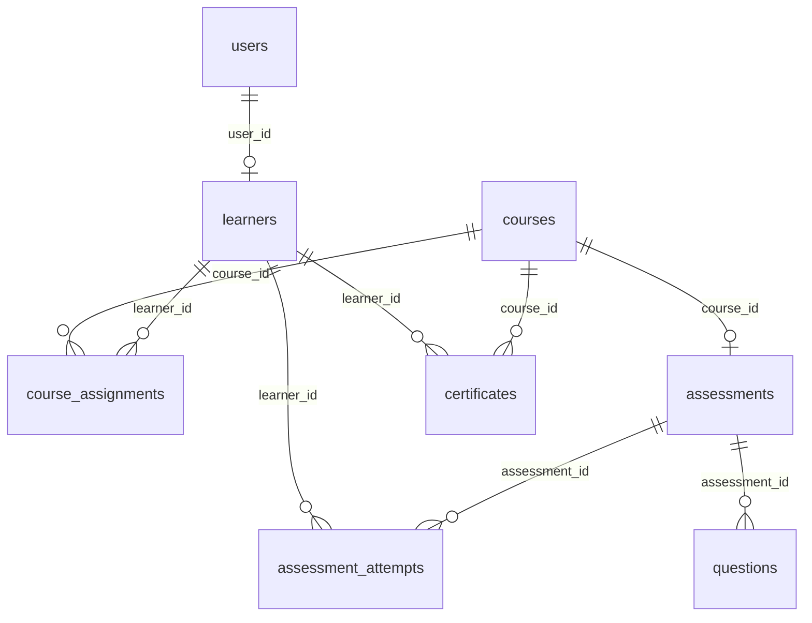

# Data model — overview

> **Sources** — interview Q6; `Proposal/Documentation/project_documentation.md:463-609`
> **Status** — [spec]
> **Page-size budget** — used 42 / 150 lines

SQLite database file: `backend/training_demo.db`. No separate database server. ORM: SQLAlchemy. All primary keys are `INTEGER PRIMARY KEY AUTOINCREMENT`; foreign keys reference `id` columns.

<a id="tables"></a>
## Tables

| Table | Purpose | Page |
|---|---|---|
| users | login accounts (role ADMIN \| LEARNER) | [users.md](users.md) |
| courses | training courses | [courses.md](courses.md) |
| learners | learner records | [learners.md](learners.md) |
| course_assignments | course ↔ learner link with progress | [course_assignments.md](course_assignments.md) |
| assessments | one quiz per course | [assessments.md](assessments.md) |
| questions | multiple-choice questions in an assessment | [questions.md](questions.md) |
| assessment_attempts | one learner's submitted result | [assessment_attempts.md](assessment_attempts.md) |
| certificates | issued certificates | [certificates.md](certificates.md) |

<a id="er-diagram"></a>
## ER diagram



<a id="conventions"></a>
## Conventions
- Enum values are uppercase strings with `CHECK` constraints (see `docs/sources/decisions/2026-08-24-schema-concretizations.md`).
- Timestamps are `TEXT` ISO-8601 UTC via `datetime('now')`.
- Soft delete is not used; deletes are hard deletes.

<a id="verify"></a>
## Verify

```bash
python -c "import sqlite3; c=sqlite3.connect('backend/training_demo.db'); print(sorted(r[0] for r in c.execute(\"SELECT name FROM sqlite_master WHERE type='table' AND name NOT LIKE 'sqlite_%'\")))"
```
Expected: `['assessment_attempts','assessments','certificates','course_assignments','courses','learners','questions','users']`.
